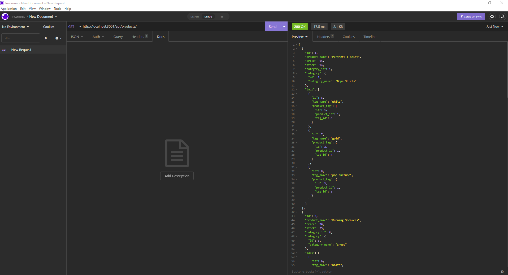

# e-commerce-backend
## Badges
  
  
  ## Table of Contents
  * [License](#license)
  * [Built With](#built-with) 
  * [Description](#description)
  * [Installation](#installation)
  * [Usage](#usage)
  * [How to Contribute](#how-to-contribute)
  * [Tests](#tests)
  * [Questions?](#questions)
  
  ## License
  Read more about MIT here:
  [MIT](https://opensource.org/licenses/MIT)

  ## Built With
  * Node.js
  * MYSQL
  * Express.js
  * Sequelize
  
  
  ## Description
  Internet retail, also known as e-commerce, is the largest sector of the electronics industry, having generated an estimated US$29 trillion in 2017 (Source: United Nations Conference on Trade and Development). E-commerce platforms like Shopify and WooCommerce provide a suite of services to businesses of all sizes. Due to the prevalence of these platforms, developers should understand the fundamental architecture of e-commerce sites. Your challenge is to build the back end for an e-commerce site. You’ll take a working Express.js API and configure it to use Sequelize to interact with a MySQL database.

  
  
  ## Installation
  Clone the project. Run "npm i" in your terminal to install necessary packages. Connect to your instance of MySQL, create the database schema "mysql> source db/schema.sql;". Populate the database by running "npm run seed". 
  
  ## Usage
  Start the server by running "npm start". Leverage Insomnia to navigate the API routes. 

[Link to Demo](https://youtu.be/7xqe20-4yT0)
  
  ## How to Contribute
  [Contributor Covenant](https://www.contributor-covenant.org/)  
  Not Applicable
  
  ## Tests
  Not Applicable
  
  ## Questions?
  ### Reach me here: 
  [erbeard](https://github.com/erbeard)  
  sample@sample.com